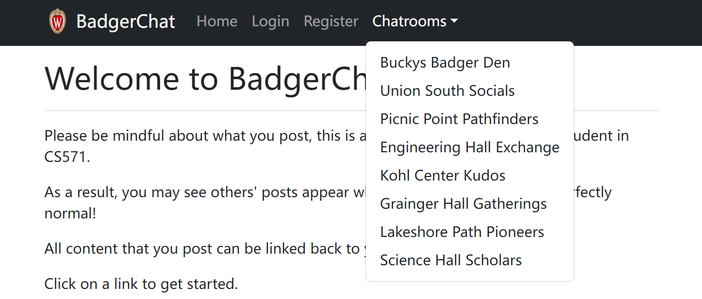
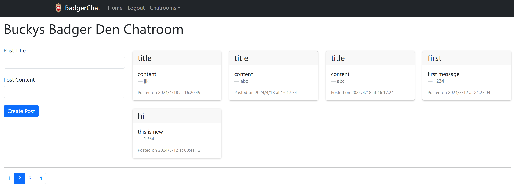
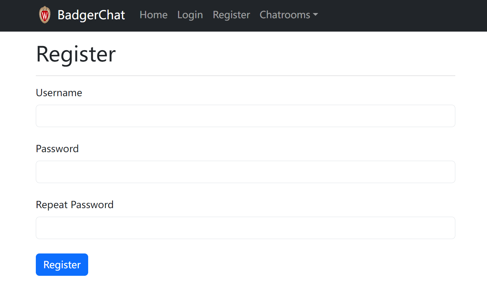
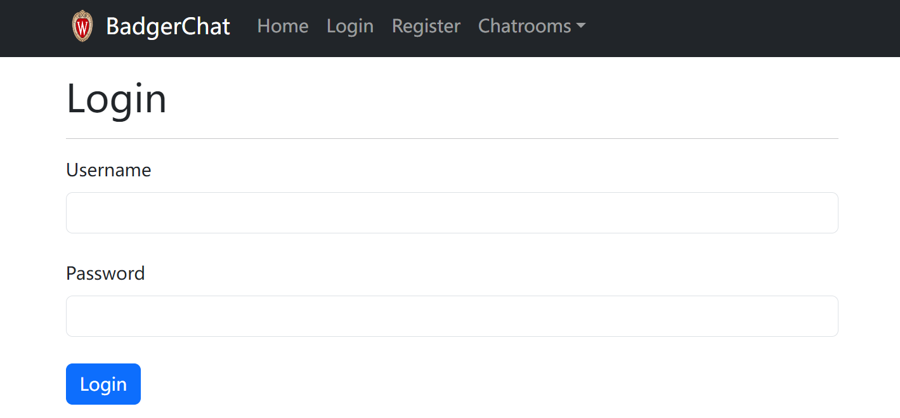
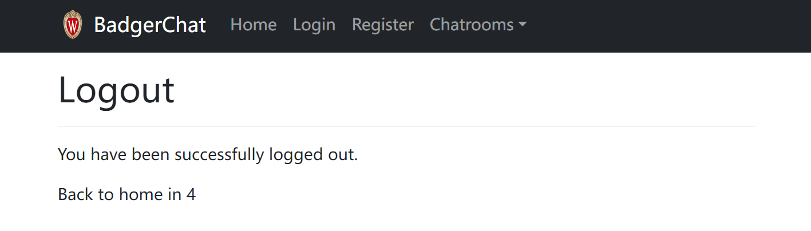
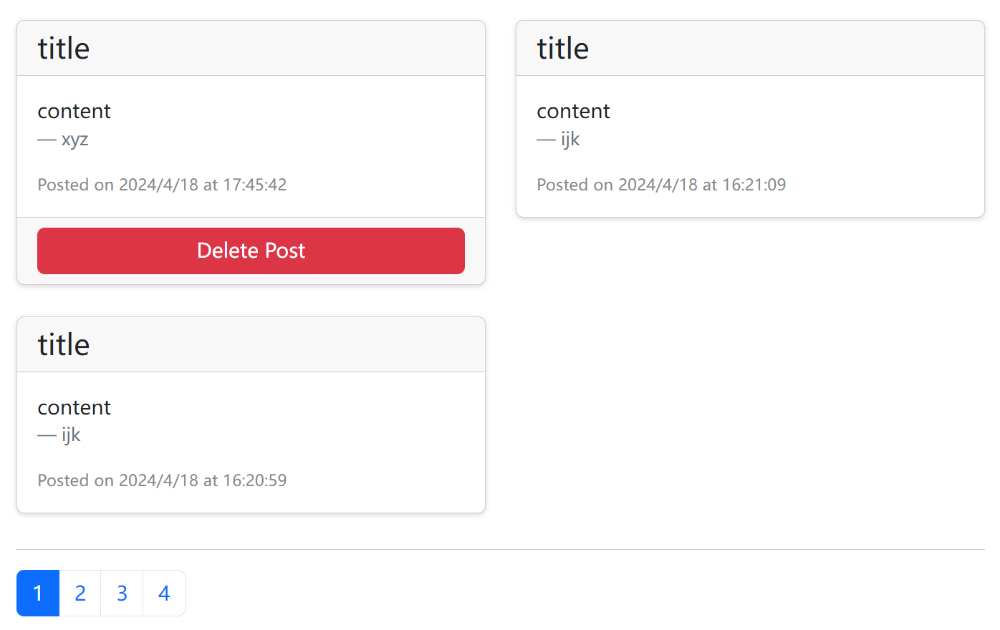

# Hi there!

This repository hosts a project called BadgerChat, which is a fork of CS571 homework #6, an online chatroom/forum.
Here is the [LINK](https://github.com/CS571-S24/hw6) to the source repository.

* The project uses react-router to create a multi page app which has functionality such as register, login, logout, post and delete.
* It interacts with a real HTTP API (Check API_DOCUMENTATION.md), and uses SessionStorage and Context to mantain/consume login status.
* I also use react-bootstrap to create a responsive user interface.

To run the program, you'll need a Badger ID.

--------------------------------

### Some Screenshots

#### 1. Navigation Bar

#### 2. Chatroom

#### 3. Registration

#### 4. Login

#### 5. Logout

#### 6. Delete Posts

