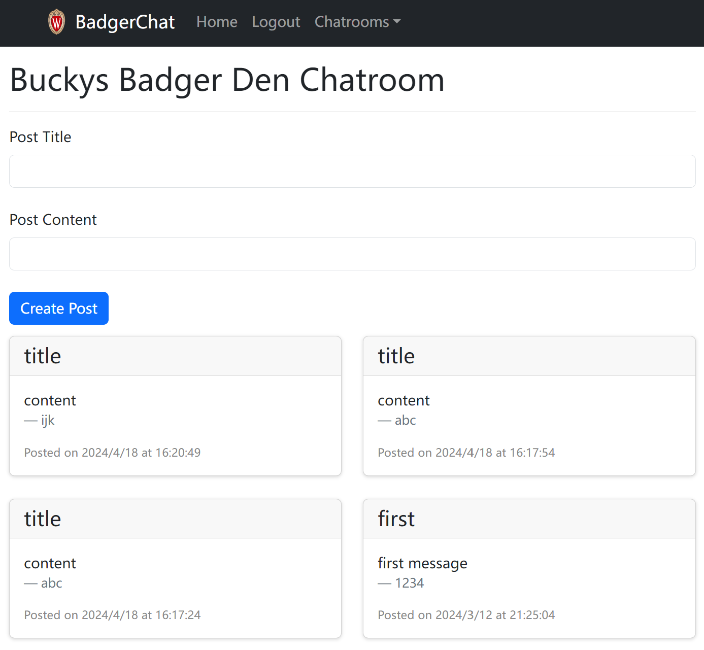

# Hi there!

This repository hosts a project called BadgerChat, an online chatroom/forum.

* The project uses react-router to create a multi page app which has functionality such as register, login, logout, post and delete.
* It interacts with a real HTTP API (Check API_DOCUMENTATION.md), and uses SessionStorage and Context to mantain/consume login status.
* I also use react-bootstrap to create a responsive user interface.

To run the program, you'll need a Badger ID.

There is also a mobile version of this App, check [here](https://github.com/CherryTale/my-BadgerChat-mobile).

--------------------------------

### Some Screenshots

#### 1. Navigation Bar

#### 2. Chatroom

#### 3. Registration

#### 4. Login

#### 5. Logout

#### 6. Delete Posts

